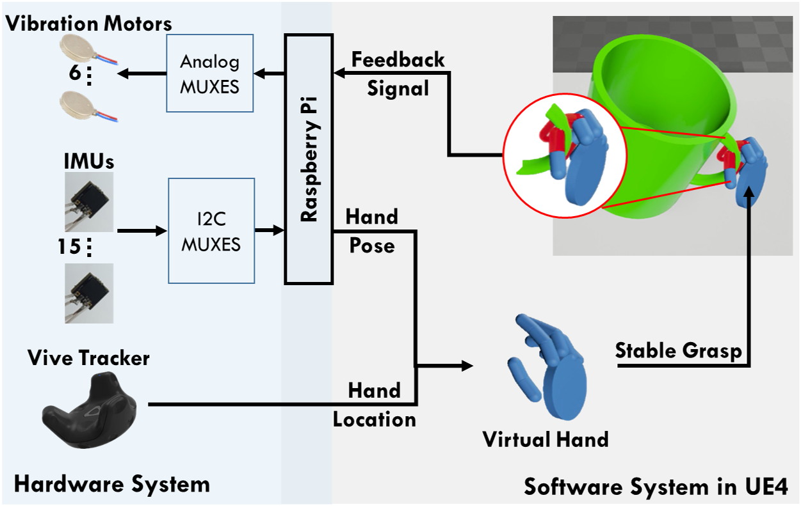
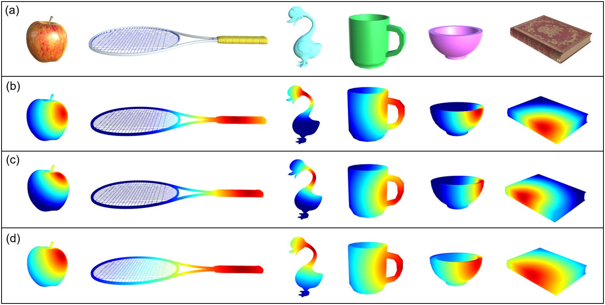
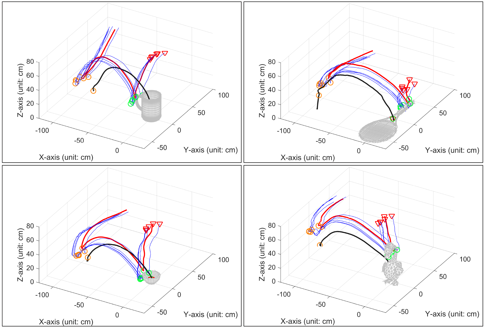

# VR Glove System

This repo introduces the UE4 code and Raspberry Pi ISO for our ICRA 2019 paper.  

[High-Fidelity Grasping in Virtual Reality using a Glove-based System](./doc/ICRA19.pdf)  
Hangxin Liu, Zhenliang Zhang, Xu Xie, Yixin Zhu, Yue Liu, Yongtian Wang, Song-Chun Zhu  
To appear in *Proceedings of the IEEE International Conference on Robotics and Automation (ICRA)*, 2019.  

This paper presents a design that jointly provides hand pose sensing, hand localization, and haptic feedback to facilitate real-time stable grasps in Virtual Reality (VR). The design is based on an easy-to-replicate glove-based system that can reliably perform (i) a high-fidelity hand pose sensing in real time through a network of 15 IMUs, and (ii) the hand localization using a Vive Tracker. The supported physicsbased simulation in VR is capable of detecting collisions and contact points for virtual object manipulation, which drives the collision event to trigger the physical vibration motors on the glove to signal the user, providing a better realism inside virtual environments. A caging-based approach using collision geometry is integrated to determine whether a grasp is stable. In the experiment, we showcase successful grasps of virtual objects with large geometry variations. Comparing to the popular LeapMotion sensor, we demonstrate the proposed glove-based design yields a higher success rate in various tasks in VR. We hope such a glove-based system can simplify the data collection of human manipulations with VR. For further details, please refer to our [paper](./doc/ICRA19.pdf). 



# Examples

We show some demos about grasping different objects.



The following figure shows logged trajectories.



A video demo could be found [here](./video/VRGloveSmall.mp4).

# Prerequisites

**Hardware**
* Raspberry Pi 2 Model B
* HTC Vive
* VR Glove with IMUs

**Software**
* Unreal Engine 4.14 on Windows 10


# Usage

## Install

1. Download the Raspberry Pi ISO from here: https://drive.google.com/drive/u/1/folders/1rJFXuYfVE6J7oO_y629rIC2xenuIMJlL

2. Then install the ISO to your own Raspberry Pi. Make sure your VR glove is the same as ours. The technical details can refer to our paper. Finally, Connect the Raspberry Pi with your VR glove.

3. Install UE4.14 to your windows computer, and download our project here: https://drive.google.com/drive/u/1/folders/10IToMae5PgqOwekfzZXOuK1ySSHYx0ea

4. Install Steam VR to set up the HTC Vive. Then open the VR device support in UE4 and compile the project.


## Run

To run the whole system, you need to make sure that the windows computer and the raspberry are in the same local area network, and their communication works well. If the IP address of Raspberry Pi is 192.168.1.235, you can open a cmd window and enter:
```
ssh pi@192.168.1.235
```
And enter the password: raspberry

Then you have successfully logged in the Raspberry Pi.

You need to log in three terminals (cmd windows) to the Raspberry Pi in total.

In the first terminal, enter the following command to start the ROS service:
```
roscore
```

In the second terminal, enter the following command to collect the IMU data in real time:
```
rosrun imutracker imutracker
``` 

In the thrid terminal, enter the following command to send the IMU data to the windows computer. For example, if the IP address of the windows computer is 192.168.1.82, then enter:
```
rosrun winbridge bridge 192.168.1.82 8000
``` 

Open the UE4 project and select the map called "GloveVisualization", and click "Play (VR Preview)" inside the toolbar. Now you should see the virtual hand can move in the same way as your VR glove.


# Citation

If you find the paper and the code helpful, please cite us.
```
@inproceedings{Liu2019High,
    author={Liu, Hangxin and Zhang, Zhenliang and Xie, Xu and Zhu, Yixin and Liu, Yue and Wang, Yongtian and Zhu, Song-Chun},
    title={High-Fidelity Grasping in Virtual Reality using a Glove-based System},
    booktitle={Proceedings of the IEEE International Conference on Robotics and Automation (ICRA)},
    year={2019}
}
```


